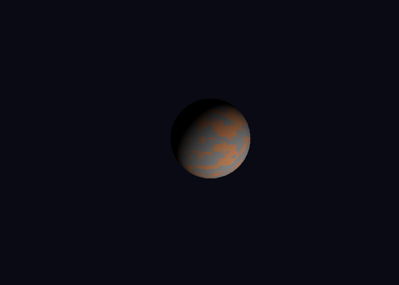
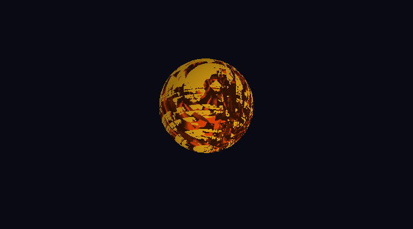
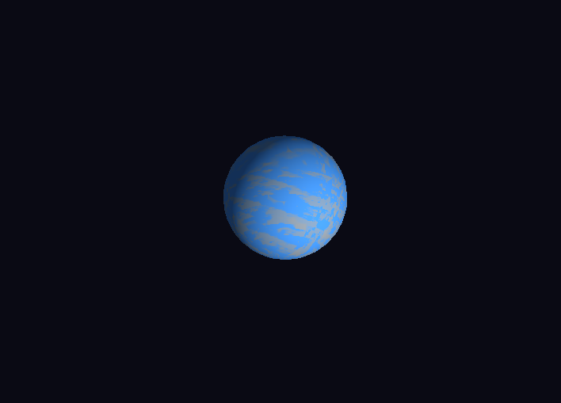
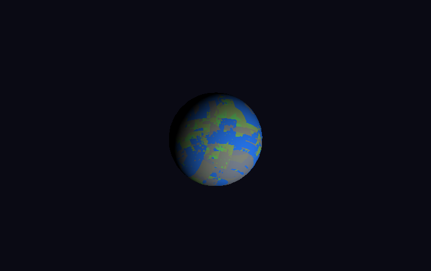

# Laboratorio 4: Planetas con shader

Cada planeta es generado de forma completamente **procedural**, combinando *vertex shaders*, *fragment shaders* y funciones de ruido (Perlin, Worley, fBm, Value Noise).

El laboratorio demuestra cómo crear diferentes tipos de cuerpos planetarios sin utilizar modelos externos, únicamente deformando y coloreando geometría básica con shaders personalizados.

---

## 🪐 Planetas generados

A continuación se muestran los planetas actualmente disponibles en el laboratorio:

### 🌍 Planeta Rocoso
Superficie irregular con tonos rojizos y marrones.  
Simula la erosión, cráteres y variaciones minerales usando ruido fractal.

---

### 🌀 Planeta Gaseoso
Formado por nubes turbulentas y bandas atmosféricas en movimiento.  
El shader utiliza ruido fBm y distorsión temporal para simular dinámica gaseosa.

---

### 🌋 Planeta Volcánico
Superficie con lava incandescente y zonas de basalto oscuro.  
La textura se genera con ruido de alto contraste y emisión simulada.

---

### ❄️ Planeta Helado
Composición de hielo y minerales fríos.  
Presenta reflejos azulados y patrones fractales de congelación.

---

### 💫 Planeta Tierra
Planeta rocoso con nubes que simula ser el planeta Tierra.  

---

## Controles

### 🧭 Navegación de Cámara

| **Tecla** | **Acción** |
|:----------:|:-----------|
| W | Rotar hacia arriba *(pitch +)* |
| S | Rotar hacia abajo *(pitch -)* |
| A | Rotar a la izquierda *(yaw +)* |
| D | Rotar a la derecha *(yaw -)* |
| ↑ | Zoom in *(acercar)* |
| ↓ | Zoom out *(alejar)* |
| Q / ← | Pan horizontal izquierda |
| E / → | Pan horizontal derecha |
| R | Pan vertical arriba |
| F | Pan vertical abajo |

---

### ✨ Selección de Shaders

| **Tecla** | **Planeta** |
|:----------:|:------------|
| 1 | Planeta Rocoso |
| 2 | Gigante Gaseoso |
| 3 | Planeta de Lava |
| 4 | Mundo de Hielo |
| 5 | Planeta con Nubes |
| **Espacio** | Auto-rotación ON/OFF |
| **Esc** | Salir |

